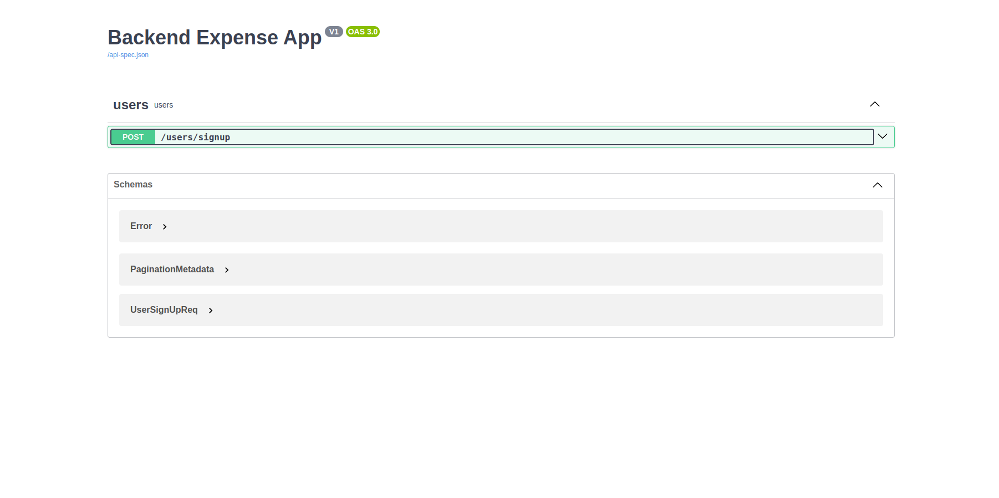

# How to run this project.
Create a python virtual environment.
# Install requirements.txt 
```pip3 install -r requirements.txt```
# Run app.py 
```python3 app.py```
# Swagger is integrated in this Projected
Swagger path would be 
```http://{host_adress}:{port}/swagger-ui``` for local it would look like if running on port 5000 : 
```http://127.0.0.1:5000/swagger-ui```
